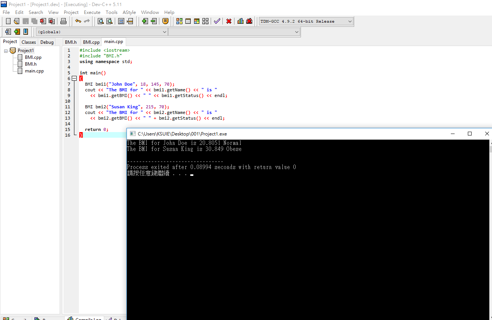

# cpp  string類別(class)及其方法實測:

>* http://www.cplusplus.com/reference/string/

>* http://www.cplusplus.com/reference/string/string/

>* https://www.geeksforgeeks.org/c-string-class-and-its-applications/

```
// C++ program to demonstrate various function string class
#include <bits/stdc++.h>  //相當於引入了所有標準函式庫
using namespace std;      //使用標準命名空間
 
int main()
{
    // various constructor of string class 字串類別的建構子
 
    // initialization by raw string 設置一個原始str1字串為"first string"
    string str1("first string"); 
 
    // initialization by another string 使用字串物件 將str1丟進str2
    string str2(str1);
 
    // initialization by character with number of occurence
    string str3(5, '#');
 
    // initialization by part of another string
    string str4(str1, 6, 6); // from 6th index (second parameter)
                             // 6 characters (third parameter)
 
    // initialization by part of another string : iteartor version
    string str5(str2.begin(), str2.begin() + 5);
 
    cout << str1 << endl;
    cout << str2 << endl;
    cout << str3 << endl;
    cout << str4 << endl;
    cout << str5 << endl;
 
    //  assignment operator
    string str6 = str4;
 
    // clear function deletes all character from string
    str4.clear();
 
    //  both size() and length() return length of string and
    //  they work as synonyms
    int len = str6.length(); // Same as "len = str6.size();"
 
    cout << "Length of string is : " << len << endl;
 
    // a particular character can be accessed using at /
    // [] operator
    char ch = str6.at(2); //  Same as "ch = str6[2];"
 
 
    cout << "third character of string is : " << ch << endl;
 
    //  front return first character and back returns last charcter
    //  of string
 
    char ch_f = str6.front();  // Same as "ch_f = str6[0];"
    char ch_b = str6.back();   // Same as below
                               // "ch_b = str6[str6.length() - 1];"
 
    cout << "First char is : " << ch_f << ", Last char is : "
         << ch_b << endl;
 
    // c_str returns null terminated char array version of string
    const char* charstr = str6.c_str();
    printf("%s\n", charstr);
 
    // append add the argument string at the end
    str6.append(" extension");
    //  same as str6 += " extension"
 
    // another version of appends, which appends part of other
    // string
    str4.append(str6, 0, 6);  // at 0th position 6 character
 
    cout << str6 << endl;
    cout << str4 << endl;
 
    //  find returns index where pattern is found.
    //  If pattern is not there it returns predefined
    //  constant npos whose value is -1
 
    if (str6.find(str4) != string::npos)
        cout << "str4 found in str6 at " << str6.find(str4)
             << " pos" << endl;
    else
        cout << "str4 not found in str6" << endl;
 
    //  substr(a, b) function returns a substring of b length
    //  starting from index a
    cout << str6.substr(7, 3) << endl;
 
    //  if second argument is not passed, string till end is
    // taken as substring
    cout << str6.substr(7) << endl;
 
    //  erase(a, b) deletes b character at index a
    str6.erase(7, 4);
    cout << str6 << endl;
 
    //  iterator version of erase
    str6.erase(str6.begin() + 5, str6.end() - 3);
    cout << str6 << endl;
 
    str6 = "This is a examples";
 
    //  replace(a, b, str)  replaces b character from a index by str
    str6.replace(2, 7, "ese are test");
 
    cout << str6 << endl;
 
    return 0;
}
Run on IDE
```
### Output :
```
first string
first string
#####
string
first
Length of string is : 6
third character of string is : r
First char is : s, Last char is : g
string
string extension
string
str4 found in str6 at 0 pos
ext
extension
string nsion
strinion
These are test examples
```

### 類別(class)設計:BMI類別的設計 教科書ch10.7

#[1]BMI類別的定義 ==> BMI.h
```
#ifndef BMI_H
#define BMI_H

#include <string>
using namespace std;

class BMI
{
public:
  BMI(const string& newName, int newAge, double newWeight, double newHeight);
  BMI(const string& newName, double newWeight, double newHeight);
  double getBMI() const;
  string getStatus() const;
  string getName() const;
  int getAge() const;
  double getWeight() const;
  double getHeight() const;

private:
  string name;
  int age;
  double weight;
  double height;
};

#endif
```
#[2]BMI類別的實作 ==> BMI.cpp
```
#include <iostream>
#include "BMI.h"
using namespace std;

BMI::BMI(const string& newName, int newAge, 
  double newWeight, double newHeight)
{
  name = newName;
  age = newAge;
  weight = newWeight;
  height = newHeight;
}

BMI::BMI(const string& newName, double newWeight, double newHeight)
{
  name = newName;
  age = 20;
  weight = newWeight;
  height = newHeight;
}

double BMI::getBMI() const
{
  const double KILOGRAMS_PER_POUND = 0.45359237;
  const double METERS_PER_INCH = 0.0254;
  double bmi = weight * KILOGRAMS_PER_POUND /
    ((height * METERS_PER_INCH) * (height * METERS_PER_INCH));
  return bmi;
}

string BMI::getStatus() const
{
  double bmi = getBMI();
  if (bmi < 18.5)
    return "Underweight";
  else if (bmi < 25)
    return "Normal";
  else if (bmi < 30)
    return "Overweight";
  else
    return "Obese";
}

string BMI::getName() const
{
  return name;
}

int BMI::getAge() const
{
  return age;
}

double BMI::getWeight() const
{
  return weight;
}

double BMI::getHeight() const
{
  return height;
}
```
#[3]使用BMI類別==> mainBMI.cpp
```
#include <iostream>
#include "BMI.h"
using namespace std;

int main()
{
  BMI bmi1("John Doe", 18, 145, 70);
  cout << "The BMI for " << bmi1.getName() << " is "
    << bmi1.getBMI() << " " << bmi1.getStatus() << endl;

  BMI bmi2("Susan King", 215, 70);
  cout << "The BMI for " << bmi2.getName() << " is "
    << bmi2.getBMI() << " " + bmi2.getStatus() << endl;

  return 0;
}
```

